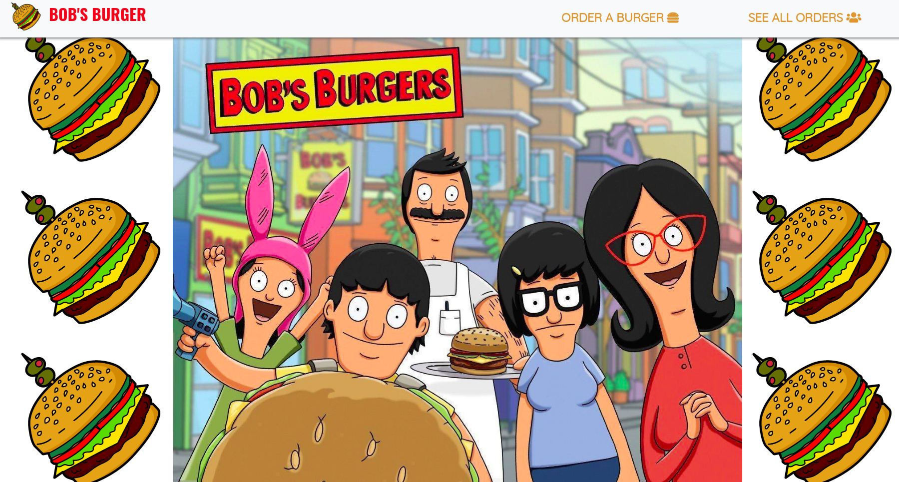

## BOB'S BURGER

### Install Node packages
Execute the command `npm install`  both on the back directory (/back) and front directory (/front).

### Create Database
Execute the command `CREATE DATABASE burger` on the psql terminal (first install Postgress SQL DB).

### npm run build
Execute the command `npm run build` on the front directory (/front) to run webpack.

### npm start
Execute the command `npm start` on the back directory (/back) to run the server. Head over to [http://localhost:8000](http://localhost:8000)

